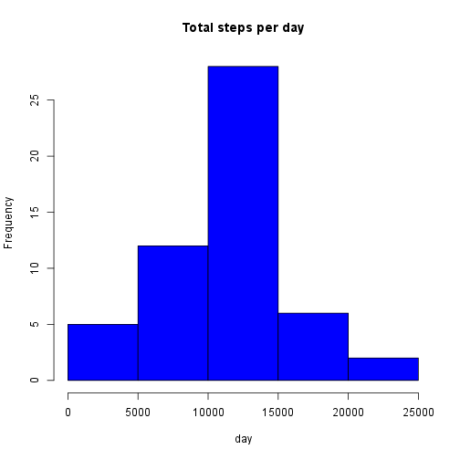
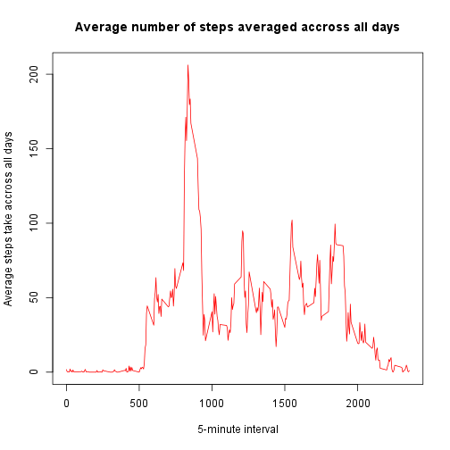
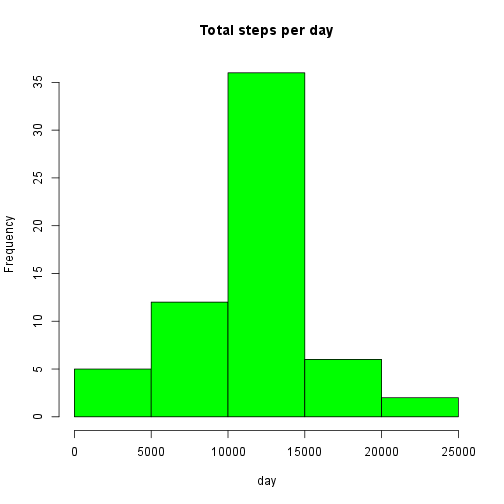
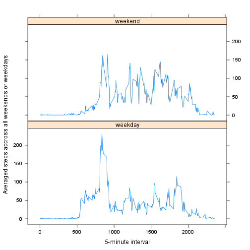

## Loading and preprocessing the data

#### Here we unzip/extract the data file, read it while setting colums classes and convert date to date class

```r
unzip("activity.zip")
activity <- read.csv("activity.csv", colClasses = c("numeric", "character", 
    "numeric"))

activity$date <- as.Date(activity$date, "%Y-%m-%d")
```

## What is mean total number of steps taken per day?

#### Calculate the total number of steps taken per day and show sample of resultant.

```r
totalSteps <- aggregate(steps ~ date, activity, sum)
head(totalSteps)
```

```
##         date steps
## 1 2012-10-02   126
## 2 2012-10-03 11352
## 3 2012-10-04 12116
## 4 2012-10-05 13294
## 5 2012-10-06 15420
## 6 2012-10-07 11015
```
#### Make a histogram of the total number of steps taken each day

```r
hist(totalSteps$steps, main = "Total steps per day", xlab = "day", col = "blue")
```

 

#### Mean of the total number of steps taken per day

```r
mean(totalSteps$steps)
```

```
## [1] 10766.19
```

#### Median of the total number of steps taken per day

```r
median(totalSteps$steps)
```

```
## [1] 10765
```


## What is the average daily activity pattern?

#### Calculate average steps per interval

```r
avgStepsPerInterval <- aggregate(steps ~ interval, activity, mean)
```

#### Make a time series plot (i.e. type = "l") of the 5-minute interval (x-axis) and the average number of steps taken, averaged across all days (y-axis)

```r
plot(avgStepsPerInterval, type='l', col= "red", 
  	main="Average number of steps averaged accross all days", xlab="5-minute interval", 
    ylab="Average steps take accross all days")
```

 

#### Which 5-minute interval, on average across all the days in the dataset, contains the maximum number of steps?

```r
avgStepsPerInterval$interval[which.max(avgStepsPerInterval$steps)]
```

```
## [1] 835
```


## Imputing missing values

#### Calculate and report the total number of missing values in the dataset (i.e. the total number of rows with NAs)

```r
sum(is.na(activity))
```

```
## [1] 2304
```

#### Devise a strategy for filling in all of the missing values in the dataset.

My strategy would be to fill the missing values (NAs) in the steps column with the mean for that 5-minute interval

#### Create a new dataset that is equal to the original dataset but with the missing data filled in.

```r
newActivity <- activity 
for (i in 1:nrow(newActivity)) {
    if (is.na(newActivity$steps[i])) {
        newActivity$steps[i] <- avgStepsPerInterval[which(newActivity$interval[i] == avgStepsPerInterval$interval), ]$steps
    }
}

head(newActivity)
```

```
##       steps       date interval
## 1 1.7169811 2012-10-01        0
## 2 0.3396226 2012-10-01        5
## 3 0.1320755 2012-10-01       10
## 4 0.1509434 2012-10-01       15
## 5 0.0754717 2012-10-01       20
## 6 2.0943396 2012-10-01       25
```


```r
sum(is.na(newActivity))
```

```
## [1] 0
```


#### Calculate the new total number of steps taken per day and show sample of resultant.

```r
newTotalSteps <- aggregate(steps ~ date, newActivity, sum)
head(newTotalSteps)
```

```
##         date    steps
## 1 2012-10-01 10766.19
## 2 2012-10-02   126.00
## 3 2012-10-03 11352.00
## 4 2012-10-04 12116.00
## 5 2012-10-05 13294.00
## 6 2012-10-06 15420.00
```
#### Make a histogram of the total number of steps taken each day

```r
hist(newTotalSteps$steps, main = "Total steps per day", xlab = "day", col = "green")
```

 

#### New mean of the total number of steps taken per day

```r
mean(newTotalSteps$steps)
```

```
## [1] 10766.19
```

#### New median of the total number of steps taken per day

```r
median(newTotalSteps$steps)
```

```
## [1] 10766.19
```

#### Do mean and median values differ from the estimates from the first part of the assignment? What is the impact of imputing missing data on the estimates of the total daily number of steps?
Yes the median value differs from the estimates from the first part of the assignment. After imputing missing values in the dataset, the new mean of total steps taken per day is equal to the old mean whereas the new median of total steps taken per day is greater than that of the old median. Also in the new calculation the mean and median values are equal.

## Are there differences in activity patterns between weekdays and weekends?

#### Create a new factor variable in the dataset with two levels – “weekday” and “weekend” indicating whether a given date is a weekday or weekend day.


```r
newActivity$weekdays <- weekdays(newActivity$date)

newActivity$DayType[(newActivity$weekdays == "Saturday" | newActivity$weekdays == "Sunday")] <- "weekend"
newActivity$DayType[!(newActivity$weekdays == "Saturday" | newActivity$weekdays == "Sunday")] <- "weekday"

newActivity$DayType <- factor(newActivity$DayType)
```
#### Calculate the average number of steps taken accoss all weekdays and weekends


```r
avgStepsDayType <- aggregate(steps~interval+DayType, newActivity, mean)
head(avgStepsDayType)
```

```
##   interval DayType      steps
## 1        0 weekday 2.25115304
## 2        5 weekday 0.44528302
## 3       10 weekday 0.17316562
## 4       15 weekday 0.19790356
## 5       20 weekday 0.09895178
## 6       25 weekday 1.59035639
```

```r
str(avgStepsDayType)
```

```
## 'data.frame':	576 obs. of  3 variables:
##  $ interval: num  0 5 10 15 20 25 30 35 40 45 ...
##  $ DayType : Factor w/ 2 levels "weekday","weekend": 1 1 1 1 1 1 1 1 1 1 ...
##  $ steps   : num  2.251 0.445 0.173 0.198 0.099 ...
```
#### Make a panel plot containing a time series plot (i.e. type = "l") of the 5-minute interval (x-axis) and the average number of steps taken, averaged across all weekday days or weekend days (y-axis)


```r
library(lattice)
xyplot(steps ~ interval | DayType, data = avgStepsDayType, type = "l", xlab = "5-minute interval", 
  	ylab = "Averaged steps accross all weekends or weekdays", layout = c(1, 2))
```

 

