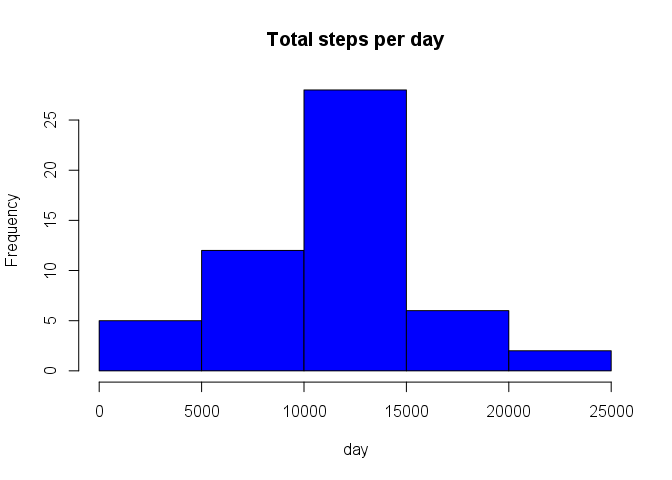
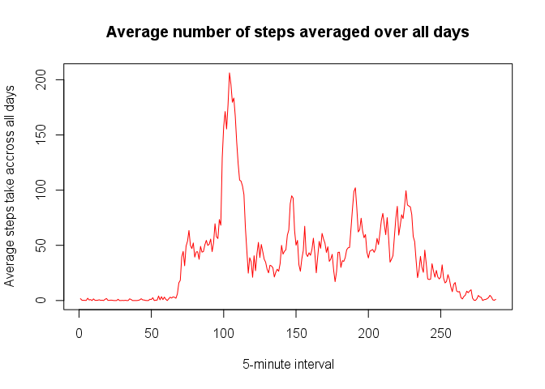

# Reproducible Research: Peer Assessment 1


## Loading and preprocessing the data

Here we unzip/extract the data file, read it while setting colums classes and convert date to date class

```r
unzip("activity.zip")
activity <- read.csv("activity.csv", colClasses = c("numeric", "character", 
    "numeric"))

activity$date <- as.Date(activity$date, "%Y-%m-%d")
```

## What is mean total number of steps taken per day?

Calculate the total number of steps taken per day and show sample of resultant.

```r
totalSteps <- aggregate(steps ~ date, activity, sum)
head(totalSteps)
```

```
##         date steps
## 1 2012-10-02   126
## 2 2012-10-03 11352
## 3 2012-10-04 12116
## 4 2012-10-05 13294
## 5 2012-10-06 15420
## 6 2012-10-07 11015
```
Make a histogram of the total number of steps taken each day

```r
hist(totalSteps$steps, main = "Total steps per day", xlab = "day", col = "blue")
```

 
Mean of the total number of steps taken per day

```r
round(mean(totalSteps$steps))
```

```
## [1] 10766
```
Median of the total number of steps taken per day

```r
median(totalSteps$steps)
```

```
## [1] 10765
```


## What is the average daily activity pattern?

Calculate average steps per interval

```r
avgStepsPerInterval <- tapply(activity$steps, activity$interval, mean, na.rm = TRUE)
```

Make a time series plot (i.e. type = "l") of the 5-minute interval (x-axis) and the average number of steps taken, averaged across all days (y-axis)

```r
plot(avgStepsPerInterval, type='l', col= "red", 
  	main="Average number of steps averaged over all days", xlab="5-minute interval", ylab="Average steps take accross all days")
```

 

Which 5-minute interval, on average across all the days in the dataset, contains the maximum number of steps?


## Imputing missing values


## Are there differences in activity patterns between weekdays and weekends?
